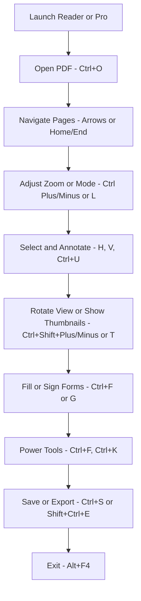

 **Shortcut System Introduction:**  
 Navigate, view, annotate, and manage PDFs in Adobe Acrobat Reader (and Acrobat Pro) with keyboard shortcuts organized by task for maximum efficiency.

---

## 1. File Management

|**Action**|**Shortcut**|
|---|---|
|Open File|Ctrl + O|
|Close File|Ctrl + W|
|Save|Ctrl + S|
|Save As|Shift + Ctrl + S|
|Print|Ctrl + P|
|Attach to Email|Alt + E, M|
|Export to Word/Excel/Image|Shift + Ctrl + E|
|Quit Reader|Alt + F4|

### Advanced File Management

|**Action**|**Shortcut / Method**|
|---|---|
|Switch between open PDFs|Ctrl + Tab / Ctrl + Shift + Tab|
|Open Recent Files submenu|Alt + F, R|
|Add file to “Recent” manually|_(No direct shortcut)_|
|Record a snapshot of current view (PDF)|Shift + S|

---

## 2. Navigation & Zoom

|**Action**|**Shortcut**|
|---|---|
|Next Page|Right Arrow|
|Previous Page|Left Arrow|
|First Page|Home|
|Last Page|End|
|Go to Page|Ctrl + Shift + N|
|Zoom In|Ctrl + +|
|Zoom Out|Ctrl + –|
|Fit Page|Ctrl + 0|
|Fit Width|Ctrl + 2|

### Advanced Navigation

|**Action**|**Shortcut**|
|---|---|
|Toggle Reading Mode (UI‑free)|Ctrl + H|
|Previous View (last zoom/pan)|Shift + Backspace|
|Next View|Backspace|
|Show Thumbnails|Ctrl + Shift + T|

---

## 3. View & Layout

|**Action**|**Shortcut**|
|---|---|
|Single Page View|Ctrl + 1|
|Two Page View|Ctrl + 3|
|Continuous Scroll|Ctrl + 6|
|Full‑Screen Mode|Ctrl + L|
|Rotate View Clockwise|Ctrl + Shift + +|
|Rotate View Counterclockwise|Ctrl + Shift + –|
|Show/Hide Rulers|Ctrl + R|
|Show/Hide Navigation Pane|F4|

### Advanced View & Layout

|**Action**|**Shortcut**|
|---|---|
|Toggle Toolbars|Ctrl + /|
|Show Comments List|Ctrl + Shift + 8|
|Show Layers Pane|Shift + F7|
|Show Attachments Pane|Shift + F8|

---

## 4. Selection & Annotation

|**Action**|**Shortcut**|
|---|---|
|Hand Tool|H|
|Select Tool|V|
|Snapshot Tool|Shift + S|
|Find Text|Ctrl + F|
|Highlight Text|Ctrl + U|
|Add Sticky Note|Ctrl + 6|
|Add Text Comment|Ctrl + Shift + T|
|Add Stamp|Shift + Ctrl + 5|

### Advanced Selection & Annotation _(Acrobat Pro)_

|**Action**|**Shortcut**|
|---|---|
|Add File Attachment Comment|Ctrl + Shift + A|
|Underline Text|Ctrl + Shift + U|
|Strikethrough Text|Ctrl + Shift + X|
|Show Comments Pane|Ctrl + Shift + 8|
|Spell Check Comments|Ctrl + Shift + Y|

---

## 5. Page Manipulation

|**Action**|**Shortcut / Method**|
|---|---|
|Rotate Page View|Ctrl + Shift + + / –|
|Show Page Thumbnails|Ctrl + Shift + T|
|Extract Page Range|File > Print > Pages|
|Insert from Scanner|File > Create > Scanner|

### Advanced Page Manipulation _(Acrobat Pro)_

|**Action**|**Shortcut**|
|---|---|
|Edit Text & Images|Ctrl + E|
|Recognize Text (OCR)|Shift + Ctrl + O|
|Combine Files|Ctrl + Shift + I|
|Organize Pages Pane|Shift + Ctrl + K|
|Add Watermark|Tools > Edit PDF > Watermark|

---

## 6. Form & Sign

|**Action**|**Shortcut**|
|---|---|
|Fill & Sign Tool|Shift + Ctrl + F|
|Add Signature|Shift + Ctrl + G|
|Tab Through Fields|Tab|
|Submit Form|Shift + Ctrl + K|
|Save Filled Form|Shift + Ctrl + S|

### Advanced Form & Sign _(Acrobat Pro)_

|**Action**|**Shortcut**|
|---|---|
|Prepare Form Tools|Shift + Ctrl + P|
|Certificates Tool|Shift + Ctrl + C|
|Distribute Form|File > Distribute Form|
|Manage Digital IDs|Preferences > Signatures|

---

## 7. Power Features & Extensions

|**Action**|**Shortcut / Method**|
|---|---|
|Advanced Search|Shift + Ctrl + F|
|Read Out Loud|Shift + Ctrl + Y|
|Accessibility Checker|Shift + Ctrl + 7|
|JavaScript Console|Ctrl + J|
|Preferences|Ctrl + K|

### Extended Advanced Features _(Pro & Integrations)_

|**Action**|**Shortcut / Method**|
|---|---|
|Preflight Check|Shift + Ctrl + X|
|Action Wizard (Batch)|Alt + F9|
|Create & Run JavaScript|Tools > JavaScript > Run|
|HTTP LiveCycle Integration|Tools > Prepare Form|
|PDF Portfolio Tools|Tools > Create Portfolio|

---

## 8. Visual Workflow Flowchart

