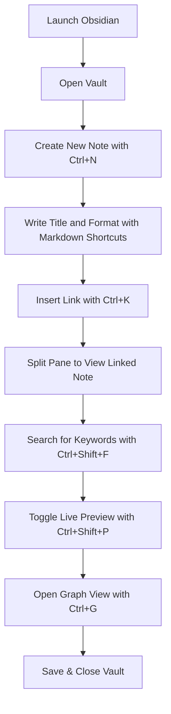

 **Shortcut System Introduction:**  
 Speed through all stages of note‑taking—from vault management to writing, linking, layout and review—using Obsidian’s keyboard shortcuts.

---

## 1. Essential Workspace Commands

First, control your vault and overall workspace without leaving the keyboard.

|**Action**|**Shortcut**|
|---|---|
|Open Command Palette|`Ctrl + P`|
|Open Quick Switcher (goto note)|`Ctrl + O`|
|Open Settings|`Ctrl + ,`|
|Toggle Left Sidebar|`Ctrl + E`|
|Toggle Right Sidebar|`Ctrl + Shift + E`|
|Toggle Tags Pane|`Ctrl + Shift + T`|
|Toggle Full Screen Mode|`F11`|
|Focus Mode (hide sidebars)|`Ctrl + Shift + F`|
|Open Graph View|`Ctrl + G`|
|Open Backlinks Pane|`Ctrl + Shift + K`|

---

## 2. Note Creation & Navigation

Quickly create, switch, and navigate between your notes.

|**Action**|**Shortcut**|
|---|---|
|Create New Note|`Ctrl + N`|
|Rename Current Note|`F2`|
|Open Note in New Pane|`Ctrl + Enter`|
|Go Back / Forward|`Alt + Left` / `Alt + Right`|
|Reveal in File Explorer|`Ctrl + Shift + R`|
|Open Daily Note|`Ctrl + D`|

---

## 3. Editor Formatting Shortcuts

Write and format your text faster with inline markdown commands.

|**Action**|**Shortcut**|
|---|---|
|Toggle Bold|`Ctrl + B`|
|Toggle Italic|`Ctrl + I`|
|Toggle Strikethrough|`Ctrl + Shift + S`|
|Toggle Inline Code|`` Ctrl + ` ``|
|Toggle Code Block|`Ctrl + Shift + C`|
|Toggle Heading 1|`Ctrl + 1`|
|Toggle Heading 2|`Ctrl + 2`|
|Toggle Heading 3|`Ctrl + 3`|
|Toggle Bullet List|`Ctrl + L`|
|Toggle Numbered List|`Ctrl + Shift + L`|
|Toggle Task List|`Ctrl + Shift + 7`|
|Indent / Unindent List|`Tab` / `Shift + Tab`|
|Create Blockquote|`Ctrl + Shift + >`|
|Create Horizontal Rule|`Ctrl + Shift + -`|
|Toggle Link|`Ctrl + K`|
|Toggle Embed (File/Block)|`Ctrl + Alt + B`|

---

## 4. Linking & Embedding

Build a network of notes and embed content seamlessly.

|**Action**|**Shortcut**|
|---|---|
|Open Link to New Note|`Ctrl + K`, then `[[]]`|
|Open Link to Existing Note|`Ctrl + K`|
|Open Block Reference|`Ctrl + Alt + K`|
|Open Embed (Internal File)|`Ctrl + Alt + E`|
|Follow Link under Cursor|`Ctrl + Click`|
|Jump to Linked Heading|`Ctrl + Click`|
|Show all Outgoing Links|`Ctrl + Shift + U`|
|Show all Incoming Links|`Ctrl + Shift + I`|

---

## 5. Panes & Layout Management

Arrange your workspace into multiple panes and navigate between them.

|**Action**|**Shortcut**|
|---|---|
|Open New Vertical Split|`Ctrl + Shift + V`|
|Open New Horizontal Split|`Ctrl + Shift + H`|
|Move Focus to Next Pane|`Ctrl + Alt + Arrow`|
|Move Focus to Previous Pane|`Ctrl + Alt + Shift + Arrow`|
|Swap Panes|`Ctrl + Alt + S`|
|Close Active Pane|`Ctrl + W`|
|Toggle Preview/Edit Mode|`Ctrl + E`|
|Toggle Live Preview|`Ctrl + Shift + P`|

---

## 6. Search & Command Palette

Find text, commands, and notes instantly.

|**Action**|**Shortcut**|
|---|---|
|Open Search|`Ctrl + F`|
|Search in All Notes|`Ctrl + Shift + F`|
|Find Next|`F3`|
|Find Previous|`Shift + F3`|
|Replace in File|`Ctrl + H`|
|Replace in All Files|`Ctrl + Shift + H`|
|Open Command Palette|`Ctrl + P`|

---

## 7. Multi‑Edit & Find/Replace

Edit multiple instances simultaneously.

|**Action**|**Shortcut**|
|---|---|
|Select Next Occurrence|`Ctrl + D`|
|Select All Occurrences|`Ctrl + Shift + D`|
|Add Cursor Above|`Ctrl + Alt + Up`|
|Add Cursor Below|`Ctrl + Alt + Down`|
|Column (Box) Selection|`Ctrl + Alt + Drag Mouse`|

---

## 8. Graph View & Backlinks

Visualize and explore your note graph and backlink relationships.

|**Action**|**Shortcut**|
|---|---|
|Open Graph View|`Ctrl + G`|
|Focus on Current Note in Graph|`Ctrl + Shift + G`|
|Toggle Backlinks Pane|`Ctrl + Shift + K`|
|Reveal Unlinked Mentions|`Ctrl + Shift + M`|

---

## 9. Advanced Plugins & Customization

Leverage community plugins and customize your workflow.

|**Action**|**Shortcut / Method**|
|---|---|
|Open Hotkeys Settings|`Ctrl + ,`, then Hotkeys|
|Open Plugin Options|`Ctrl + ,`, then Community Plugins|
|Trigger Custom Command|Via Command Palette|
|Open Template Insert Menu|`Ctrl + T` _(templater)_|
|Run Dataview Query|`Dataview: Execute` in Palette|
|Toggle Mobile View|`Ctrl + Shift + M`|

---

## 10. Simple Workflow Walkthrough

Below is a step‑by‑step flow for a typical note‑taking session in Obsidian:

