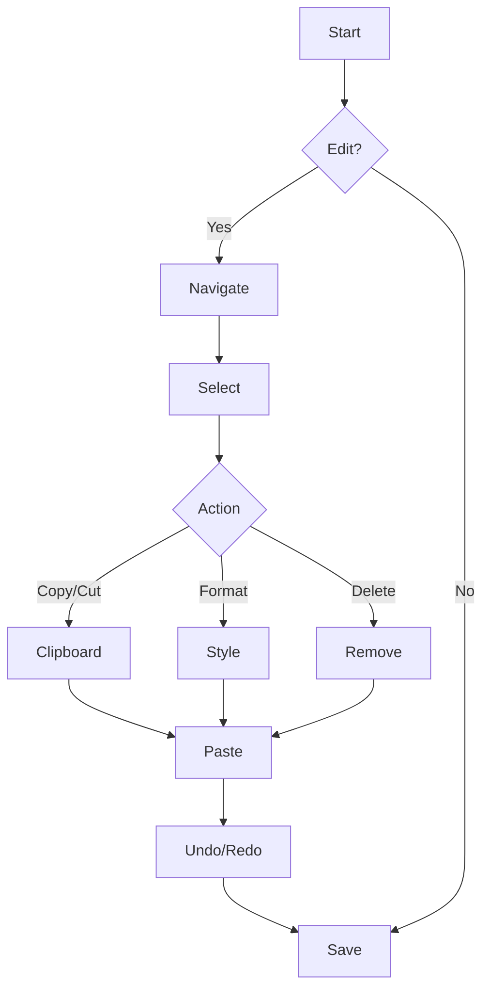

**Introduction:**  
At the core of text editing is the **caret** (the blinking insertion point) that indicates where text appears as you type. Mastering both the basic and advanced shortcuts across all text editing tasks—from navigation and selection to clipboard operations, undo/redo, and formatting—will dramatically boost your efficiency. Each category below features an “Advanced” section with extra shortcuts and tips available in many modern editors.

---

## 1. Navigation Shortcuts

**Basic Commands:**  
These shortcuts let you move the caret quickly without a mouse.

|**Shortcut**|**Action**|**Example/Usage**|
|---|---|---|
|Left/Right Arrow|Move the caret one character left/right|Fine-tune your placement near a typo|
|Up/Down Arrow|Move the caret one line up/down|Jump between lines in a paragraph|
|Ctrl + Left/Right|Move the caret one word left/right|Skip through words quickly|
|Home|Move the caret to the beginning of the line|Quickly reposition for editing at the start of a line|
|End|Move the caret to the end of the line|Move to the end for appending text|
|Page Up / Page Down|Scroll and move the caret one page|Navigate long documents swiftly|

**Advanced Navigation:**  
These additional shortcuts and techniques help you move more efficiently in large documents or structured text.

|**Advanced Shortcut**|**Action**|**Example/Usage**|
|---|---|---|
|Ctrl + Home|Move the caret to the very beginning of the document|Start over quickly in a multi-page document|
|Ctrl + End|Move the caret to the very end of the document|Jump immediately to your document’s conclusion|
|Ctrl + Up/Down (in code editors)|Move the caret by entire blocks, such as paragraphs or code blocks|Useful in code editors like VS Code or Sublime Text|
|Alt + Left/Right (in browsers)|Navigate backward or forward through text editing history or previous states (in some apps)|Quickly return to a previous text state or location|

_Tip:_ In many advanced editors, additional plugins or settings can further enhance navigation (for example, jump-to-definition in coding environments).

---

## 2. Text Selection Shortcuts

**Basic Selection:**  
Quickly highlight text for copying, cutting, or formatting.

|**Shortcut**|**Action**|**Example/Usage**|
|---|---|---|
|Shift + Arrow Keys|Extend selection one character at a time|Gradually select a word or sentence|
|Ctrl + Shift + Left/Right|Extend selection one word at a time|Rapidly select multiple words for mass editing|
|Shift + Home/End|Select from the caret’s position to start/end of line|Highlight an entire line|
|Ctrl + A|Select all text in the document|Useful for selecting everything for global edits|

**Advanced Selection:**  
These techniques help in selecting structured or patterned text quickly.

|**Advanced Shortcut**|**Action**|**Example/Usage**|
|---|---|---|
|Ctrl + Shift + Up/Down|Extend selection by entire paragraphs or code blocks|Quickly highlight entire paragraphs (supported in many advanced editors)|
|Ctrl + L (in some editors)|Select the current line entirely|Ideal for line-based editing in coding or log files|
|Double-click or Triple-click|Select a word (double) or an entire paragraph (triple)|Use the mouse to quickly select a logical group of text|
|Regex-based selection (via plugins)|Select text matching a regular expression pattern|Automate selection based on text patterns in advanced code editors|

_Tip:_ Some editors allow you to save and recall selection profiles or use multi-cursor editing for simultaneous multiple selections.

---

## 3. Expanded Clipboard Operations

**Basic Clipboard Operations:**  
Essential commands to store and move text.

|**Shortcut**|**Action**|**Example/Usage**|
|---|---|---|
|Ctrl + C|Copy the selected text|Duplicate a paragraph for reuse|
|Ctrl + X|Cut (remove) the selected text|Remove text to move it elsewhere without retyping|
|Ctrl + V|Paste the copied/cut text|Insert text from the clipboard at the caret position|

**Advanced Clipboard Operations:**  
Modern editors and operating systems offer extended clipboard features.

|**Advanced Shortcut**|**Action**|**Example/Usage**|
|---|---|---|
|Ctrl + Shift + V|Paste as plain text (strip formatting)|When transferring text without unwanted styles|
|Windows Key + V (Windows 10/11)|Open Clipboard History to select from multiple recent copies|Choose from a list of previous copied items for reuse|
|Alt + Ctrl + V (Paste Special)|Open Paste Special options to choose specific formats (plain text, HTML, etc.)|Retain only the text, or convert between formats as needed|
|Drag-and-Drop Text|Use the mouse to drag text from one area to another|Move text quickly without using keyboard shortcuts|
|Clipboard Managers (Third-Party Tools)|Use advanced clipboard tools that store snippets or manage multiple clipboards|For example, apps like Ditto or CopyQ offer more control and history|

_Tip:_ Explore your text editor’s settings—some allow you to customize clipboard behavior (e.g., auto-clearing, persistent history, etc.) to better fit your workflow.

---

## 4. Undo, Redo, and Advanced Deletion

**Basic Undo/Redo & Deletion:**  
These shortcuts quickly reverse or remove actions.

|**Shortcut**|**Action**|**Example/Usage**|
|---|---|---|
|Ctrl + Z|Undo the last action|Revert a deletion or change that was made in error|
|Ctrl + Y|Redo the previously undone action|Reapply an action that was accidentally reversed|
|Shift + Delete|Permanently delete selected text without copying|Remove text without placing it in the clipboard|

**Advanced Undo/Redo & Deletion:**  
Some advanced editors provide deeper control over revision history and formatting deletion.

|**Advanced Shortcut / Feature**|**Action**|**Example/Usage**|
|---|---|---|
|Multi-level Undo/Redo|Cycle through multiple past actions (often visualized as a history)|Step backward/forward through multiple changes, especially in document editors|
|Ctrl + Shift + Z|Alternative redo command used in several modern applications|Reinstate multiple actions in sequence|
|Ctrl + Backspace|Delete the previous word (instead of a single character)|Quickly erase an entire word during editing|
|Ctrl + Delete|Delete the word ahead of the caret|Remove whole words without having to hold down the delete key|
|Advanced Deletion Plugins|Some editors allow removal of specific patterns or formatting blocks|Delete all extra spaces or strip out specific formatting automatically|

_Tip:_ Look into your editor’s version control or change tracking features—these can provide even more granular control over undoing and managing revisions.

---

## 5. Additional Formatting and Editing Shortcuts

**Basic Formatting:**  
Common shortcuts to change the appearance of text.

|**Shortcut**|**Action**|**Example/Usage**|
|---|---|---|
|Ctrl + B|Bold the selected text|Highlight key phrases with bold style|
|Ctrl + I|Italicize the selected text|Emphasize technical terms or quotes|
|Ctrl + U|Underline the selected text|Mark headings or important sections|
|Ctrl + K (Some Editors)|Insert a hyperlink|Quickly embed a URL within your text|
|Ctrl + Shift + L (Some Apps)|Apply bullet list formatting|Organize items in a bulleted list easily|

**Advanced Formatting:**  
Advanced formatting features often come with specialized shortcuts or commands.

|**Advanced Shortcut / Feature**|**Action**|**Example/Usage**|
|---|---|---|
|Alt + Shift + D|Insert the current date (in many word processors)|Auto-insert the date for logs or meeting notes|
|Alt + Shift + T|Insert the current time|Useful in timestamping document changes|
|Ctrl + Shift + > / <|Increase or decrease font size|Adjust text size quickly without navigating menus|
|Format Painter (often via icon, sometimes Ctrl+Shift+C/V)|Copy and apply formatting from one section to another|Standardize text formatting across different parts of a document|
|Multi-Cursor Editing (Ctrl + Click or Alt+Click)|Insert or edit text in multiple places at once|Modify repeated content or columnar text simultaneously|

_Tip:_ Advanced editors (especially code editors) support customizable macros and snippets, which you can program to perform repeated formatting tasks with a single shortcut.

---

## 6. Visual Workflow with a Flowchart

This enhanced flowchart now illustrates both the basic and advanced actions in a typical text editing workflow, incorporating navigation, selection, advanced clipboard handling, and formatting changes.

---

