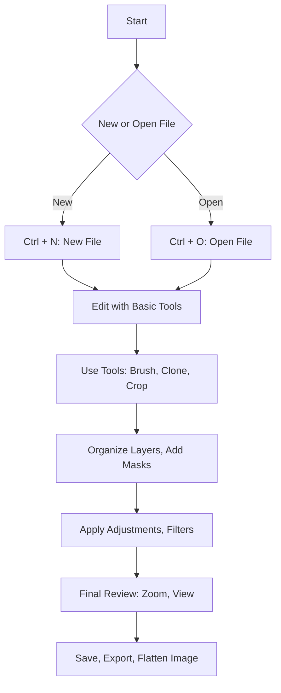

 **Shortcut System Introduction:**  
 This guide covers essential and advanced shortcuts for Adobe Photoshop, organized by editing task and tool usage for maximum workflow efficiency.

---

## 1. File Management

Efficient file management allows you to create, open, save, and export your projects quickly, keeping your workflow smooth from start to finish.

|**Action**|**Shortcut**|
|---|---|
|New File|`Ctrl + N`|
|Open File|`Ctrl + O`|
|Save|`Ctrl + S`|
|Save As|`Ctrl + Shift + S`|
|Export As|`Ctrl + Alt + Shift + W`|
|Close File|`Ctrl + W`|
|Quit Photoshop|`Ctrl + Q`|

**Advanced File Management:**

|**Action**|**Shortcut**|
|---|---|
|Revert to Last Saved|`F12`|
|Close All|`Ctrl + Alt + W`|
|Save for Web (Legacy)|`Alt + Shift + Ctrl + S`|
|Place Embedded/Linked|`Shift + Ctrl + P / D`|
|Automate Batch Processing|`Alt + F9` _(Actions)_|

---

## 2. Basic Editing

 For general editing refer to **Text Editing** section.

|**Photoshop-Specific Action**|**Shortcut**|
|---|---|
|Undo|`Ctrl + Z`|
|Step Backward|`Ctrl + Alt + Z`|
|Step Forward|`Ctrl + Shift + Z`|
|Fill|`Shift + F5`|
|Content-Aware Fill|`Shift + Delete`|
|Free Transform|`Ctrl + T`|
|Transform Again|`Ctrl + Shift + T`|
|Select All|`Ctrl + A`|
|Deselect|`Ctrl + D`|
|Invert Selection|`Shift + Ctrl + I`|

**Advanced Editing:**

|**Action**|**Shortcut**|
|---|---|
|Transform Warp|`Ctrl + T`, then `Right-Click` > Warp|
|Puppet Warp|`Alt + Ctrl + Shift + P`|
|Liquify Dialog|`Shift + Ctrl + X`|
|Feather Selection|`Shift + F6`|
|Refine Edge / Select and Mask|`Ctrl + Alt + R`|
|Copy Merged|`Shift + Ctrl + C`|

---

## 3. Tools

Photoshop’s extensive toolset provides the functionality for everything from basic drawing to complex selection, healing, and retouching operations, all accessible by intuitive shortcuts.

|**Tool**|**Shortcut**|
|---|---|
|Move Tool|`V`|
|Marquee Tools|`M`|
|Lasso Tools|`L`|
|Magic Wand / Quick Select|`W`|
|Crop Tool|`C`|
|Eyedropper Tool|`I`|
|Healing / Spot Healing|`J`|
|Brush Tool|`B`|
|Clone Stamp Tool|`S`|
|History Brush Tool|`Y`|
|Eraser Tool|`E`|
|Gradient / Paint Bucket|`G`|
|Dodge / Burn / Sponge|`O`|
|Pen Tool|`P`|
|Text Tool|`T`|
|Zoom Tool|`Z`|
|Hand Tool|`H`|

**Advanced Tool Control:**

|**Action**|**Shortcut**|
|---|---|
|Toggle Between Tool Variants|`Shift + Tool Key`|
|Precise Brush Size Adjustment|`[` / `]`|
|Change Brush Hardness|`{` / `}`|
|Airbrush Mode (Brush Tool)|`Alt + Shift + P`|
|Rotate Canvas View|`R`, then drag|
|Toggle Brush Panel|`F5`|

---

## 4. View & Navigation

Quickly navigating and zooming into your image allows you to focus on fine details or get an overview of the entire project, with tools to toggle guides, grids, and full-screen modes.

|**Action**|**Shortcut**|
|---|---|
|Zoom In|`Ctrl + +`|
|Zoom Out|`Ctrl + -`|
|Fit on Screen|`Ctrl + 0`|
|Actual Pixels|`Alt + Ctrl + 0`|
|Toggle Fullscreen Modes|`F`|
|Show/Hide Rulers|`Ctrl + R`|
|Show/Hide Grid|`Ctrl + '`|
|Show/Hide Guides|`Ctrl + ;`|
|Snap to Guides/Grid|`Shift + Ctrl + ;`|
|Switch to Hand Tool|`Spacebar`|

**Advanced View Navigation:**

|**Action**|**Shortcut**|
|---|---|
|Toggle Pixel Grid|`View > Show > Pixel Grid` _(no default)_|
|Toggle Extras (Guides/Grids/etc)|`Ctrl + H`|
|Toggle Proof Colors|`Ctrl + Y`|
|Toggle Gamut Warning|`Shift + Ctrl + Y`|

---

## 5. Layers & Masks

Managing layers and masks is essential for non-destructive editing, allowing for advanced effects, organization, and control over each part of your design or photo.

|**Action**|**Shortcut**|
|---|---|
|New Layer|`Shift + Ctrl + N`|
|Duplicate Layer|`Ctrl + J`|
|Group Layers|`Ctrl + G`|
|Ungroup Layers|`Shift + Ctrl + G`|
|Merge Layers|`Ctrl + E`|
|Merge Visible|`Shift + Ctrl + E`|
|Flatten Image|`Ctrl + Shift + E`|
|New Layer via Cut|`Shift + Ctrl + J`|

**Advanced Layer Operations:**

|**Action**|**Shortcut**|
|---|---|
|Lock Transparent Pixels|`/` (forward slash)|
|Move Layer Up/Down|`Ctrl + [` / `]`|
|Bring to Front / Send to Back|`Ctrl + Shift + [` / `]`|
|Select Layer Above/Below|`Alt + [` / `]`|
|Select All Layers|`Ctrl + Alt + A`|
|Add Layer Mask|`Alt + Click Mask Icon`|
|Apply Layer Mask|`Ctrl + Click Mask Icon`|
|Link / Unlink Layers|`Ctrl + G / Shift + Ctrl + G`|
|Create Clipping Mask|`Ctrl + Alt + G`|

---

## 6. Visual Workflow Flowchart

Powerful tools and options such as advanced transforms, adjustment layers, and custom shortcuts unlock Photoshop's full potential for professional-level editing.

