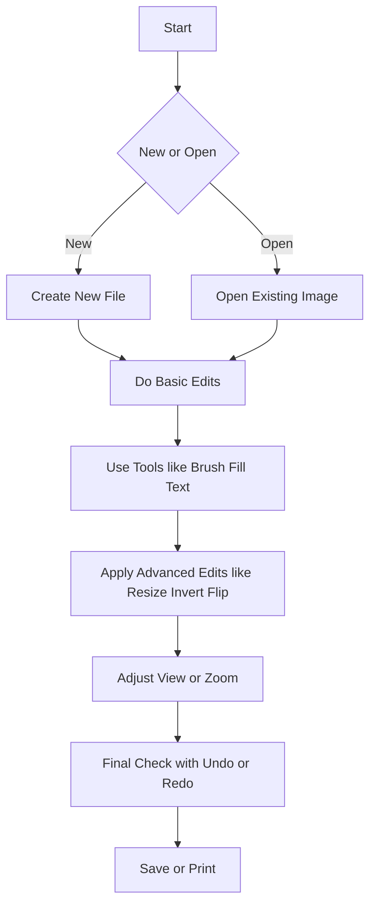

**Shortcut System Introduction:**  
 This guide is a complete system for mastering photo editing in MS Paint using keyboard shortcuts—organized by task, including both basic and advanced levels.

---

## 1. File Management

Create, open, save, or print images efficiently.

|**Action**|**Shortcut**|
|---|---|
|New File|`Ctrl + N`|
|Open File|`Ctrl + O`|
|Save File|`Ctrl + S`|
|Print|`Ctrl + P`|
|Exit Paint|`Alt + F4`|

---

## 2. Basic Editing

For general selection, copy/paste, undo/redo, refer to the **Text Editing** section of this guide.

**Additional Paint-Specific Edits:**

|**Action**|**Shortcut**|
|---|---|
|Resize / Skew Dialog|`Ctrl + W`|
|Invert Colors|`Ctrl + Shift + I`|
|Transparent Selection|`Ctrl + Shift + T`|
|Flip Horizontal|`Ctrl + H`|
|Flip Vertical|_(Menu only)_|
|Constrain Drawing Line|Hold `Shift`|

---

## 3. Tools

Switch between tools instantly and draw shapes precisely.

|**Action**|**Shortcut**|
|---|---|
|Fill Tool (Bucket)|`F`|
|Color Picker|`I`|
|Text Tool|`T`|
|Eraser|`E`|
|Brush Tool|`B`|
|Magnifier (Zoom Tool)|`Z`|

**Advanced Tools:**

|**Action**|**Shortcut**|
|---|---|
|Pencil Tool (Legacy)|`Ctrl + T` _(older builds)_|
|Alternate Color Picker|`Ctrl + I`|
|Line Tool|`L`|
|Rectangle Tool|`R`|
|Ellipse Tool|`O`|
|Curve Tool|`C`|
|Perfect Shape (Circle/Square)|Hold `Shift`|

---

## 4. Zoom & View

 Adjust the visual workspace while working with images.

|**Action**|**Shortcut**|
|---|---|
|Zoom In|`Ctrl + Page Up`|
|Zoom Out|`Ctrl + Page Down`|
|Toggle Grid|`Ctrl + G`|
|Fullscreen|`F11`|

---

## 5. Navigation & Misc

 Move selections and navigate tools quickly.

|**Action**|**Shortcut**|
|---|---|
|Move Selection|Arrow Keys|
|Cycle Through Tools|`Tab`|
|Open Help|`F1`|

6. Visual Workflow Flowchart

