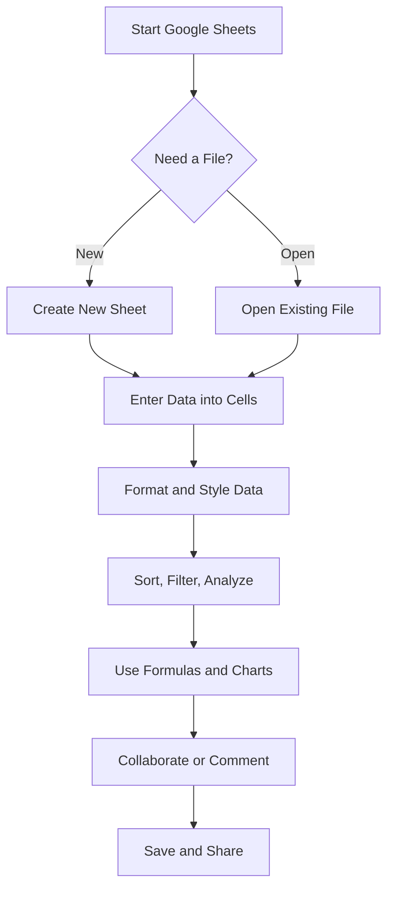

 **Shortcut System Introduction:**  
 This guide provides essential and advanced Google Sheets shortcuts for editing, navigation, formatting, and data analysis — optimized for fast keyboard-driven workflows.

---

## 1. **File Management**

|**Action**|**Shortcut**|
|---|---|
|New Spreadsheet|`Ctrl + N`|
|Open File|`Ctrl + O`|
|Save (Auto-Save by Default)|_(Automatic)_|
|Print|`Ctrl + P`|
|Rename File|`Ctrl + Alt + Shift + H` then `R`|

---

## 2. **Basic Cell Editing**

|**Action**|**Shortcut**|
|---|---|
|Edit Active Cell|`Enter` or `F2`|
|Cancel Cell Entry|`Esc`|
|Confirm Entry|`Enter`|
|Copy|`Ctrl + C`|
|Cut|`Ctrl + X`|
|Paste|`Ctrl + V`|
|Paste Values Only|`Ctrl + Shift + V`|
|Undo|`Ctrl + Z`|
|Redo|`Ctrl + Y` or `Ctrl + Shift + Z`|

**Advanced Editing**

|**Action**|**Shortcut**|
|---|---|
|Insert New Line in Cell|`Ctrl + Enter`|
|Fill Down|`Ctrl + D`|
|Fill Right|`Ctrl + R`|
|Insert Function Dialog|`Shift + F1`|
|Insert Note|`Ctrl + Shift + F2`|
|Insert Comment|`Ctrl + Alt + M`|

---

## 3. **Navigation & Selection**

|**Action**|**Shortcut**|
|---|---|
|Move Cell|`Arrow Keys`|
|Move to Edge of Data|`Ctrl + Arrow`|
|Move to Beginning|`Ctrl + Home`|
|Move to End|`Ctrl + End`|

**Selection**

|**Action**|**Shortcut**|
|---|---|
|Select Entire Row|`Shift + Space`|
|Select Entire Column|`Ctrl + Space`|
|Select All|`Ctrl + A` (twice)|
|Extend Selection|`Shift + Arrow`|
|Select to Data Edge|`Ctrl + Shift + Arrow`|

---

## 4. **Formatting**

|**Action**|**Shortcut**|
|---|---|
|Bold|`Ctrl + B`|
|Italic|`Ctrl + I`|
|Underline|`Ctrl + U`|
|Strikethrough|`Alt + Shift + 5`|
|Format as Currency|`Ctrl + Shift + 4`|
|Format as Percent|`Ctrl + Shift + 5`|
|Format as Date|`Ctrl + Shift + 3`|
|Increase Decimal|`Alt + Shift + 0`|
|Decrease Decimal|`Alt + Shift + 9`|
|Open Format Menu|`Alt + Shift + F`|

---

## 5. **Formulas & Functions**

|**Action**|**Shortcut**|
|---|---|
|Start Formula|`=`|
|AutoSum|`Alt + Shift + =`|
|Insert Function (Sidebar)|`Shift + F1`|
|Show Formula Bar|`Ctrl +` `|
|Toggle Absolute/Relative|`F4`|
|Recalculate|`Ctrl + R` (Manual Mode Only)|

---

## 6. **Data Management**

|**Action**|**Shortcut**|
|---|---|
|Sort Ascending|`Alt + Shift + S`|
|Sort Descending|`Alt + Shift + T`|
|Create Filter|`Ctrl + Shift + L`|
|Insert Chart|`Alt + Shift + C`|
|Data Validation|`Alt + Shift + D`|

**Advanced Data Shortcuts**

|**Action**|**Shortcut**|
|---|---|
|Open Filter Menu|`Alt + Down Arrow`|
|Insert Checkbox|`Alt + Shift + 7`|
|Insert Dropdown (Smart Chips)|`@` then choose type|
|Freeze Row/Column|`Alt + Shift + F` then `R` or `C`|

---

## 7. **Sheet Management**

|**Action**|**Shortcut**|
|---|---|
|Next Sheet|`Ctrl + Page Down`|
|Previous Sheet|`Ctrl + Page Up`|
|Insert New Sheet|`Shift + F11`|
|Delete Sheet|`Alt + Shift + E` then `D`|
|Rename Sheet|`Alt + Shift + E` then `R`|
|Duplicate Sheet|`Alt + Shift + E` then `U`|

## 8. **Visual Workflow Flowchart**

