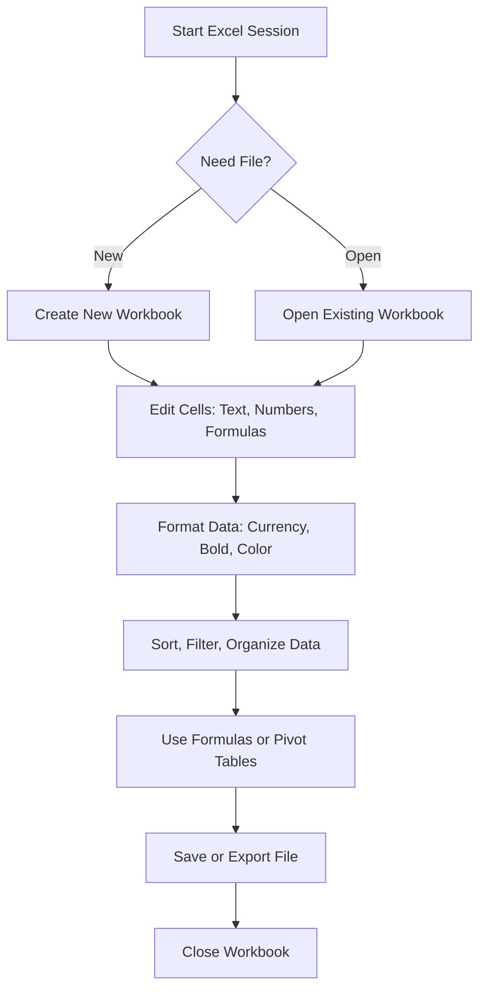

 **Shortcut System Introduction:**  
 This guide delivers essential and advanced Excel shortcuts, organized by editing task and workflow stage — designed for mastering spreadsheet editing fast and efficiently.

---

## 1. **File Management**

Quick control over your files — open, save, print, export.

|**Action**|**Shortcut**|
|---|---|
|New Workbook|`Ctrl + N`|
|Open Workbook|`Ctrl + O`|
|Save Workbook|`Ctrl + S`|
|Save As|`F12`|
|Close Workbook|`Ctrl + W`|
|Print|`Ctrl + P`|
|Exit Excel|`Alt + F4`|

---

## 2. **Basic Cell Editing**

|**Action**|**Shortcut**|
|---|---|
|Edit Active Cell|`F2`|
|Cancel Cell Entry|`Esc`|
|Confirm Entry|`Enter`|
|Fill Down|`Ctrl + D`|
|Fill Right|`Ctrl + R`|
|Copy|`Ctrl + C`|
|Paste|`Ctrl + V`|
|Cut|`Ctrl + X`|
|Delete Cell Contents|`Delete`|

**Advanced Editing**

|**Action**|**Shortcut**|
|---|---|
|Insert Cell|`Ctrl + Shift + =`|
|Delete Cell|`Ctrl + -`|
|Insert Line Break in Cell|`Alt + Enter`|
|Copy Formula from Cell Above|`Ctrl + '`|
|Enter Array Formula|`Ctrl + Shift + Enter`|
|Fill Series|`Ctrl + E` (Flash Fill)|

---

## 3. **Navigation & Selection**

|**Action**|**Shortcut**|
|---|---|
|Move One Cell|`Arrow Keys`|
|Move to Edge of Data|`Ctrl + Arrow`|
|Go to Cell (Address)|`Ctrl + G` / `F5`|
|Go to A1|`Ctrl + Home`|
|Move to Last Cell|`Ctrl + End`|

**Selection Shortcuts**

|**Action**|**Shortcut**|
|---|---|
|Select Column|`Ctrl + Space`|
|Select Row|`Shift + Space`|
|Select All|`Ctrl + A`|
|Extend Selection|`Shift + Arrow`|
|Extend to Edge|`Ctrl + Shift + Arrow`|

---

## 4. **Formatting**

|**Action**|**Shortcut**|
|---|---|
|Bold|`Ctrl + B`|
|Italic|`Ctrl + I`|
|Underline|`Ctrl + U`|
|Format Cells Dialog|`Ctrl + 1`|
|Center Align|`Alt + H, A, C`|
|Format as Currency|`Ctrl + Shift + $`|
|Format as Percentage|`Ctrl + Shift + %`|
|Increase Decimal|`Alt + H, 0`|
|Decrease Decimal|`Alt + H, 9`|

---

## 5. **Formulas & Functions**

|**Action**|**Shortcut**|
|---|---|
|Start Formula|`=`|
|AutoSum|`Alt + =`|
|Insert Function Dialog|`Shift + F3`|
|Toggle Absolute Reference|`F4`|
|Show Formulas|`Ctrl +` `|
|Calculate Sheet|`F9`|
|Calculate Workbook|`Ctrl + Alt + F9`|

**Advanced Formula Editing**

|**Action**|**Shortcut**|
|---|---|
|Trace Precedents|`Ctrl + [`|
|Trace Dependents|`Ctrl + ]`|
|Insert Name into Formula|`F3`|
|Evaluate Formula Step-by-Step|`Alt + M, V`|

---

## 6. **Table & Data Management**

|**Action**|**Shortcut**|
|---|---|
|Create Table|`Ctrl + T`|
|Insert Row|`Ctrl + Shift + +`|
|Delete Row/Column|`Ctrl + -`|
|Sort Ascending|`Alt + A, S, A`|
|Sort Descending|`Alt + A, S, D`|
|Filter|`Ctrl + Shift + L`|

**Advanced Data Shortcuts**

|**Action**|**Shortcut**|
|---|---|
|Open Filter Dropdown|`Alt + ↓`|
|Group Rows/Columns|`Alt + Shift + →`|
|Ungroup|`Alt + Shift + ←`|
|Collapse Group|`Alt + A, H`|
|Expand Group|`Alt + A, J`|
|Pivot Table|`Alt + N, V`|

---

## 7. **Worksheet Navigation**

|**Action**|**Shortcut**|
|---|---|
|Next Sheet|`Ctrl + Page Down`|
|Previous Sheet|`Ctrl + Page Up`|
|Insert Sheet|`Shift + F11`|
|Delete Sheet|`Alt + E, L`|
|Rename Sheet|`Alt + H, O, R`|
|Move/Copy Sheet|`Alt + E, M`|

8. **Visual Workflow Flowchart**

