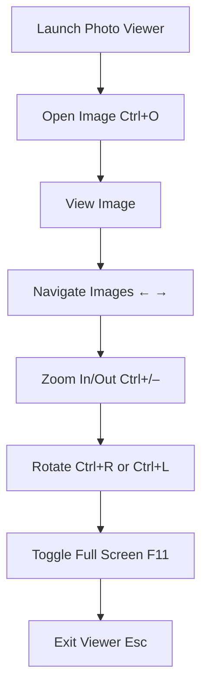

# Windows Photo Viewer – Ultimate Image Viewing Shortcuts Guide

 **Shortcut System Introduction:**  
 Master image viewing and basic management in Windows Photo Viewer with these keyboard shortcuts—organized by task for fast, mouse-free workflows.

---

## 1. File Management

 Open, print, and delete images without leaving the viewer.

|**Action**|**Shortcut**|
|---|---|
|Open Image|`Ctrl + O`|
|Print Image|`Ctrl + P`|
|Delete Image to Recycle Bin|`Delete`|
|Rename Image (in Explorer)|_(Right‑click > Rename in Explorer)_|

---

## 2. Navigation & Selection

 Move through your image collection and select files.

|**Action**|**Shortcut**|
|---|---|
|Next Image|`Right Arrow`|
|Previous Image|`Left Arrow`|
|First Image in Folder|`Home`|
|Last Image in Folder|`End`|
|Close Viewer|`Esc`|

---

## 3. Zoom & Pan

 Inspect details or fit images to your window.

|**Action**|**Shortcut**|
|---|---|
|Zoom In|`Ctrl + +`|
|Zoom Out|`Ctrl + -`|
|Fit to Window|`Ctrl + W`|
|View Actual Size|`Ctrl + 1`|
|Pan (Move Image)|_(Click and drag)_|

---

## 4. Rotation & Basic Edits

 Quickly correct orientation and manage files.

|**Action**|**Shortcut**|
|---|---|
|Rotate Clockwise|`Ctrl + R`|
|Rotate Counterclockwise|`Ctrl + L`|
|Delete Image|`Delete`|

---

## 5. Full‑Screen & Slideshow

 Present or browse images distraction‑free.

|**Action**|**Shortcut**|
|---|---|
|Toggle Full‑Screen Mode|`F11`|
|Start Slideshow|_(Click “Slide Show” button)_|
|Exit Full‑Screen or Slideshow|`Esc`|

---

## 6. Advanced File & Folder Access

 Jump to file properties or open containing folder.

|**Action**|**Shortcut / Method**|
|---|---|
|Open File Properties Dialog|`Alt + Enter`|
|Open Containing Folder|_(Right‑click > Open file location in Explorer)_|

---

## 7. Visual Workflow Flowchart

mermaid

CopyEdit

