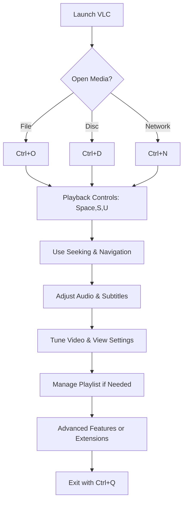

# VLC – Ultimate Video Player Shortcuts Guide

 **Shortcut System Introduction:**  
 This guide covers essential and advanced VLC Media Player shortcuts, organized by task for seamless control of playback, navigation, audio, subtitles, and more.

---

## 1. File Management

 Open, play, and manage media files and playlists effortlessly.

|**Action**|**Shortcut**|
|---|---|
|Open File|`Ctrl + O`|
|Open Disc|`Ctrl + D`|
|Open Network Stream|`Ctrl + N`|
|Open Capture Device|`Ctrl + C`|
|Play Disc|`Ctrl + L`|
|Save Playlist|`Ctrl + Y`|
|Load Playlist|`Ctrl + Shift + O`|
|Quit VLC|`Ctrl + Q`|

**Advanced File Management:**

|**Action**|**Shortcut / Method**|
|---|---|
|Add File to Playlist|Drag & drop or `Ctrl + P` in playlist view|
|Convert/Save (Transcode)|`Ctrl + R`|
|Record Current Stream|`Shift + R`|
|Snapshot (Save Frame)|`Shift + S`|

---

## 2. Playback Controls

 Start, pause, and regulate playback with precision.

|**Action**|**Shortcut**|
|---|---|
|Play/Pause|`Space`|
|Stop|`S`|
|Play Next|`N`|
|Play Previous|`P`|
|Faster|`]`|
|Slower|`[`|
|Normal Speed|`=`|
|Loop|`L`|
|Random (Shuffle)|`R`|

**Advanced Playback:**

|**Action**|**Shortcut**|
|---|---|
|Jump Forward 3 sec|`Ctrl + Right Arrow`|
|Jump Backward 3 sec|`Ctrl + Left Arrow`|
|Jump Forward 10 sec|`Alt + Right Arrow`|
|Jump Backward 10 sec|`Alt + Left Arrow`|
|Frame-by-Frame|`E`|
|Fine Speed Up/Down|`Shift + ]` / `Shift + [`|

---

## 3. Navigation & Seeking

 Quickly navigate within the media timeline.

|**Action**|**Shortcut**|
|---|---|
|Seek Forward 1 minute|`Ctrl + Up Arrow`|
|Seek Backward 1 minute|`Ctrl + Down Arrow`|
|Go to Specific Time|`Ctrl + T`|
|Time Display Toggle|`Ctrl + I`|
|Title/Chapter Menu|`Ctrl + H`|

**Advanced Seeking:**

|**Action**|**Shortcut**|
|---|---|
|Go to Percentage (e.g., 50%)|`Ctrl + number 0–9`|
|Skip to Next Chapter|`Shift + N`|
|Skip to Previous Chapter|`Shift + P`|

---

## 4. Audio Controls

 Manage volume, tracks, and audio effects on the fly.

|**Action**|**Shortcut**|
|---|---|
|Increase Volume|`Ctrl + Up Arrow`|
|Decrease Volume|`Ctrl + Down Arrow`|
|Mute/Unmute|`M`|
|Next Audio Track|`B`|
|Previous Audio Track|`V`|

**Advanced Audio:**

|**Action**|**Shortcut**|
|---|---|
|Toggle Audio Boost|`Ctrl + +`|
|Stereo Mode Cycle|`A`|
|Spatializer Toggle|`Z`|
|Equalizer Window|`Ctrl + E`|
|Compressor/Audio Effects|`Shift + O`|

---

## 5. Subtitle Controls

 Add, adjust, and synchronize subtitles with ease.

|**Action**|**Shortcut**|
|---|---|
|Toggle Subtitles|`V`|
|Next Subtitle Track|`G`|
|Previous Subtitle Track|`H`|
|Subtitle Delay +100ms|`H`|
|Subtitle Delay –100ms|`G`|

**Advanced Subtitles:**

|**Action**|**Shortcut**|
|---|---|
|Subtitle Offset +50ms|`Ctrl + H`|
|Subtitle Offset –50ms|`Ctrl + G`|
|Load External Subtitle|`Ctrl + L`|
|Subtitle Font Size Increase|`Ctrl + ]`|
|Subtitle Font Size Decrease|`Ctrl + [`|

---

## 6. Video & View

 Adjust display settings, aspect ratio, and video filters in real time.

|**Action**|**Shortcut**|
|---|---|
|Toggle Fullscreen|`F`|
|Windowed Mode|`Shift + F`|
|Aspect Ratio > 16:9|`A`|
|Aspect Ratio > 4:3|`Ctrl + A`|
|Deinterlace Mode|`D`|

**Advanced Video View:**

|**Action**|**Shortcut**|
|---|---|
|Cycle Zoom Modes|`Z`|
|Take Snapshot|`Shift + S`|
|Video Effects Panel|`Ctrl + V`|
|Crop/Transform Video|`Shift + W`|

---

## 7. Playlist & Media Library

 Organize and control your current playlist or media library.

|**Action**|**Shortcut**|
|---|---|
|Show/Hide Playlist|`Ctrl + L`|
|Save Current Playlist|`Ctrl + Y`|
|Clear Playlist|`Ctrl + R`|
|Add to Playlist|`Ctrl + P`|

**Advanced Playlist Management:**

|**Action**|**Shortcut / Method**|
|---|---|
|Reorder Items|Drag & drop in playlist view|
|Loop Single Item|Right-click item > Loop|
|Randomize Playlist|Right-click > Shuffle|
|Export/Import Playlist|Use Media > Save/Load Playlist dialogs|

---

## 8. Advanced Features & Extensions

 Power-user features, integrations, and extensibility.

|**Action**|**Shortcut / Method**|
|---|---|
|Toggle Media Information|`Ctrl + I`|
|Show Codec Information|`Ctrl + J`|
|Enable/Disable Hardware Acceleration|Preferences > Input/Codecs|
|Control via HTTP Interface|Enable in Preferences > Main Interfaces|
|Lua & VLSub Extensions|Install via Extensions Manager|
|Remote Control Shortcuts|Setup in Preferences > Hotkeys|

## 9. Visual Workflow Flowchart

