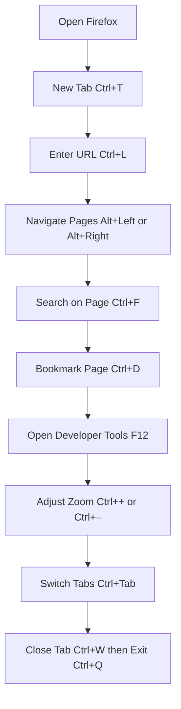

 **Shortcut System Introduction:**  
 Navigate, browse, manage tabs, and power‑use Firefox entirely from the keyboard. Below are structured categories with both basic and advanced shortcuts, concise intros, and a simple workflow walkthrough.

---

## 1. File & Window Management

Control browser windows and sessions without touching the mouse.

**Basic Shortcuts**

|**Action**|**Shortcut**|
|---|---|
|New Window|Ctrl + N|
|New Private Window|Ctrl + Shift + P|
|Close Window|Ctrl + Shift + W|
|Reopen Closed Window|Ctrl + Shift + T|
|Open File|Ctrl + O|
|Save Page As|Ctrl + S|
|Print Page|Ctrl + P|

**Advanced Shortcuts**

|**Action**|**Shortcut**|
|---|---|
|Open Firefox Menu|Alt + F or F10|
|Exit Firefox|Ctrl + Q|
|Zoom Text Only Toggle|Ctrl + Shift + Plus|
|Session Restore|Open menu then R|

---

## 2. Tab & Session Management

Work with tabs efficiently for multi‑tasking.

**Basic Shortcuts**

|**Action**|**Shortcut**|
|---|---|
|New Tab|Ctrl + T|
|Close Tab|Ctrl + W|
|Reopen Closed Tab|Ctrl + Shift + T|
|Next Tab|Ctrl + Tab|
|Previous Tab|Ctrl + Shift + Tab|
|Go to Tab 1–8|Ctrl + 1 to Ctrl + 8|
|Go to Last Tab|Ctrl + 9|

**Advanced Shortcuts**

|**Action**|**Shortcut**|
|---|---|
|Duplicate Tab|Ctrl + Shift + K|
|Move Tab Left/Right|Ctrl + Shift + Page Up/Down|
|Pin/Unpin Tab|Ctrl + Shift + P|
|Open Tabs in New Window|Ctrl + Shift + L|

---

## 3. Navigation & History

Traverse your browsing history and navigate quickly.

**Basic Shortcuts**

|**Action**|**Shortcut**|
|---|---|
|Back|Alt + Left Arrow|
|Forward|Alt + Right Arrow|
|Reload|F5|
|Reload (Bypass Cache)|Ctrl + F5|
|Stop Loading|Esc|
|Home|Alt + Home|

**Advanced Shortcuts**

|**Action**|**Shortcut**|
|---|---|
|Open History Sidebar|Ctrl + H|
|Open Full History Page|Ctrl + Shift + H|
|Navigate Forward Once|Ctrl + .|
|Navigate Backward Once|Ctrl + ,|

---

## 4. Address Bar & Search

Use the address bar for navigation and searching.

**Basic Shortcuts**

|**Action**|**Shortcut**|
|---|---|
|Focus Address Bar|Ctrl + L or Alt + D|
|Search from Address Bar|Type then Enter|
|Open Search Bar|Ctrl + K or Ctrl + E|

**Advanced Shortcuts**

|**Action**|**Shortcut**|
|---|---|
|Open Search Engine List|Ctrl + Down Arrow|
|Search Selected Text|Ctrl + E then Ctrl + V|
|Add Keyword Search|Open menu then Manage Search Engines|

---

## 5. Content Interaction

Copy, find, and interact with page content efficiently.

**Basic Shortcuts**

|**Action**|**Shortcut**|
|---|---|
|Find on Page|Ctrl + F|
|Find Next|Ctrl + G|
|Find Previous|Ctrl + Shift + G|
|Select All|Ctrl + A|
|Copy Selection|Ctrl + C|
|Paste into Field|Ctrl + V|
|Bookmark Page|Ctrl + D|

**Advanced Shortcuts**

|**Action**|**Shortcut**|
|---|---|
|Send Page Link to Device|Ctrl + Shift + L|
|View Page Source|Ctrl + U|
|Inspect Element|Ctrl + Shift + C|
|Toggle Reader View|F9|

---

## 6. Zoom & View

Adjust page scale and layout modes.

**Basic Shortcuts**

|**Action**|**Shortcut**|
|---|---|
|Zoom In|Ctrl + Plus|
|Zoom Out|Ctrl + Minus|
|Reset Zoom|Ctrl + 0|
|Toggle Fullscreen|F11|

**Advanced Shortcuts**

|**Action**|**Shortcut**|
|---|---|
|Toggle Dark Mode|Open menu then Turn on Reader Mode|
|Toggle Picture-in-Picture|Right-click video then Enter Picture in Picture|

---

## 7. Bookmark & Library

Manage bookmarks, downloads, and reading list.

**Basic Shortcuts**

|**Action**|**Shortcut**|
|---|---|
|Open Bookmarks Sidebar|Ctrl + B|
|Open Downloads Panel|Ctrl + J|
|Bookmark Current Page|Ctrl + D|
|Show Reading List Sidebar|Ctrl + Shift + B|

**Advanced Shortcuts**

|**Action**|**Shortcut**|
|---|---|
|Organize Bookmarks Dialog|Shift + Ctrl + O|
|Open Synced Tabs Sidebar|Ctrl + Shift + Y|

---

## 8. Developer Tools

Access built‑in developer utilities.

**Basic Shortcuts**

|**Action**|**Shortcut**|
|---|---|
|Toggle Developer Tools|F12 or Ctrl + Shift + I|
|Toggle Console|Ctrl + Shift + K|
|Toggle Inspector|Ctrl + Shift + C|
|Toggle Network Monitor|Ctrl + Shift + E|

**Advanced Shortcuts**

|**Action**|**Shortcut**|
|---|---|
|Responsive Design Mode|Ctrl + Shift + M|
|Edit CSS on Page|In Developer Tools|
|Debug JavaScript|F8 / F10 / F11|
|Clear Browser Cache|Ctrl + Shift + Delete|

---

## 9. Extensions & Custom Commands

Enhance Firefox with add‑ons and custom shortcuts.

|**Action**|**Shortcut / Method**|
|---|---|
|Open Add‑ons Manager|Ctrl + Shift + A|
|Enable/Disable Extension|In Add‑ons Manager|
|Customize Keyboard Shortcuts|Open menu then Add‑ons and Themes > Manage Your Shortcuts|
|Launch Custom Script|Via user script manager add‑on|

---

## 10. Visual Workflow Walkthrough

A simple browsing session from launch to exit.

