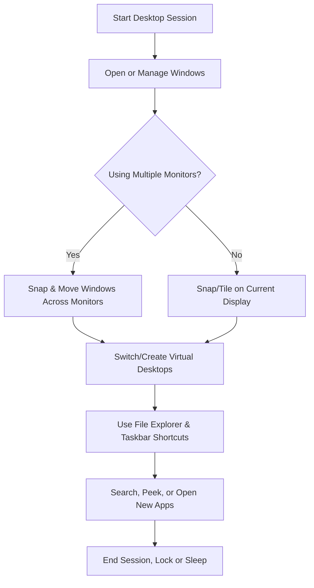

 **Intro:**  
 Navigate, manage, and organize your workspace with precision using these shortcuts. This guide covers everything from basic desktop actions to advanced workflows for power users.

---

## 1. 🔳 Basic Window Management

|**Action**|**Shortcut**|
|---|---|
|Minimize active window|`Win + Down Arrow`|
|Maximize active window|`Win + Up Arrow`|
|Restore from maximized|`Win + Down Arrow` (twice)|
|Snap window left/right|`Win + Left/Right Arrow`|
|Close current window|`Alt + F4`|
|Switch between windows|`Alt + Tab`|
|Open new window of current app|`Ctrl + N` _(depends on app)_|

---

## 2. 🖼️ Virtual Desktops

|**Action**|**Shortcut**|
|---|---|
|Open Task View|`Win + Tab`|
|Create new virtual desktop|`Win + Ctrl + D`|
|Close current virtual desktop|`Win + Ctrl + F4`|
|Switch to next/previous desktop|`Win + Ctrl + Right/Left Arrow`|
|Move window to adjacent desktop|`Win + Ctrl + Shift + Left/Right`|

---

## 3. 🧮 Desktop Interaction

|**Action**|**Shortcut**|
|---|---|
|Show desktop|`Win + D`|
|Peek at desktop|`Win + ,`|
|Open Start Menu|`Win`|
|Open Quick Link menu|`Win + X`|
|Open Notification Center|`Win + N`|
|Open Action Center|`Win + A`|

---

## 4. 📂 File Explorer & Taskbar Control

|**Action**|**Shortcut**|
|---|---|
|Open File Explorer|`Win + E`|
|Focus address bar in Explorer|`Ctrl + L`|
|Cycle taskbar apps|`Win + T`|
|Open pinned taskbar app|`Win + 1` to `Win + 9`|
|Minimize all windows|`Win + M`|
|Restore minimized windows|`Win + Shift + M`|

---

## 5. ⚙️ Advanced Window & Monitor Management

|**Action**|**Shortcut**|
|---|---|
|Move window between monitors|`Shift + Win + Left/Right Arrow`|
|Cascade all windows|`Right-click Taskbar > Cascade`|
|Show windows side-by-side|`Right-click Taskbar > Side by Side`|
|Snap to quadrant (grid)|Use `Win + Arrows` repeatedly|
|FancyZones snapping (PowerToys)|Custom zones (manual setup)|
|Toggle always-on-top (PowerToys)|`Win + Ctrl + T` (if enabled)|

---

## 6. 🧠 Advanced Virtual Desktop Management

|**Action**|**Method**|
|---|---|
|Rename desktops|`Win + Tab`, then click name|
|Rearrange desktops|`Win + Tab`, drag desktops|
|Assign apps to a desktop|Right-click app in Task View|
|Persistent desktops or layouts|Use third-party tools (e.g. VirtuaWin)|

---

## 7. 🧰 Automation & Power Features

|**Action**|**Tool / Method**|
|---|---|
|Auto-launch apps/layouts|Task Scheduler + Batch script|
|Arrange windows into layout|PowerToys FancyZones|
|Custom keyboard macros|AutoHotKey or Microsoft Power Automate|
|Toggle desktop icons|Right-click Desktop > View|
|Assign shortcuts to specific monitors|DisplayFusion (3rd party tool)|

---

## 8. 📁 File & Folder Navigation Shortcuts

|**Action**|**Shortcut**|
|---|---|
|Open File Explorer|`Win + E`|
|Focus address bar|`Ctrl + L`|
|Go up one folder|`Alt + ↑`|
|Go back/forward in folder history|`Alt + ← / →`|
|Search current folder|`Ctrl + E` or `F3`|
|Create new folder|`Ctrl + Shift + N`|
|Rename selected file/folder|`F2`|
|Delete item to Recycle Bin|`Del`|
|Permanently delete item|`Shift + Del`|
|Open properties|`Alt + Enter`|

---

## 9. 🔎 Search Shortcuts

|**Action**|**Shortcut**|
|---|---|
|Open Start and search|`Win` then type|
|Open Search directly|`Win + S`|
|Open File Explorer search bar|`Ctrl + E` or `F3`|
|Open Run dialog|`Win + R`|
|Open Windows Settings search|`Win + I`, then Tab to Search|

---

## 10. 📈 Visual Flowchart – Desktop Workflow

