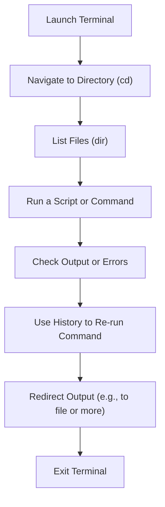

 **Shortcut System Introduction:**  
 The command line is a keyboard-first interface—shortcuts are essential for navigation, editing, and managing processes efficiently.

---

## 🔹 1. Launch & Exit

|**Action**|**Shortcut / Command**|
|---|---|
|Open Command Prompt|Win + R → `cmd` → Enter|
|Open PowerShell|Win + X → I (Admin: A)|
|Open Windows Terminal|Win + X → Terminal|
|Exit Terminal|`exit` or Ctrl + D|

---

## 🔹 2. Cursor Movement & Text Navigation

|**Action**|**Shortcut**|
|---|---|
|Move to Beginning of Line|Home|
|Move to End of Line|End|
|Move Left/Right|← / →|
|Jump by Word|Ctrl + ← / Ctrl + →|
|Delete Previous Character|Backspace|
|Delete Word to Left|Ctrl + Backspace|
|Delete Word to Right|Ctrl + Delete|
|Clear Current Line|Esc|

---

## 🔹 3. Command Editing & Clipboard

|**Action**|**Shortcut**|
|---|---|
|Copy Selected Text|Ctrl + C (when selection)|
|Paste|Ctrl + V|
|Cut Selected Text|Ctrl + X (PowerShell only)|
|Select All|Ctrl + A|
|Delete to End of Line|Ctrl + End|
|Undo Last Edit|Ctrl + Z|

---

## 🔹 4. Command History & Reuse

|**Action**|**Shortcut**|
|---|---|
|Previous Command|↑|
|Next Command|↓|
|Command History List|F7|
|Search Previous Commands|F8 + type prefix|
|Reuse Previous Arguments|F3 (entire), F1 (char-by-char)|

---

## 🔹 5. Navigation Within File System

|**Action**|**Command / Shortcut**|
|---|---|
|Change Directory|`cd foldername`|
|Go Up One Folder|`cd ..`|
|List Directory Contents|`dir`|
|Clear Terminal Screen|`cls`|
|Autocomplete Path or Command|Tab|
|Cycle Through Tab Suggestions|Tab repeatedly|

---

## 🔹 6. Terminal Tabs, Panes & Zoom (Windows Terminal)

|**Action**|**Shortcut**|
|---|---|
|New Tab|Ctrl + Shift + T|
|Close Tab|Ctrl + Shift + W|
|Next Tab|Ctrl + Tab|
|Previous Tab|Ctrl + Shift + Tab|
|Split Pane (Horizontal/Vert.)|Alt + Shift + - / +|
|Resize Pane|Alt + Arrow Keys|
|Zoom In/Out|Ctrl + + / Ctrl + -|
|Reset Zoom|Ctrl + 0|

---

## 🔹 7. Process Management & Output Control

|**Action**|**Shortcut / Command**|
|---|---|
|Cancel Current Command|Ctrl + C|
|Pause Output|Ctrl + S|
|Resume Output|Ctrl + Q|
|Scroll Output Up/Down|Ctrl + ↑ / ↓|
|Pipe Output to File|`command > file.txt`|
|View Paged Output|`command|

---

## 🔹 8. Advanced PowerShell Shortcuts

|**Action**|**Shortcut / Feature**|
|---|---|
|IntelliSense Popup|Ctrl + Space|
|Insert Current Directory|Alt + .|
|Multiline Edit Mode|Shift + Enter|
|Search History (Incremental)|Ctrl + R|
|Launch Editor (`code`, `notepad`)|Use inline: `notepad .\file.txt`|

---

## 🔹 9. Miscellaneous / Utility

|**Action**|**Shortcut / Command**|
|---|---|
|Open Properties|Alt + Space → P|
|Toggle Fullscreen|Alt + Enter|
|Copy Output of Last Command|Use right-click menu|
|Enable QuickEdit Mode|Right-click title bar → Properties|

---

## 🔹 10. Flowchart – Typical Command Line Workflow
